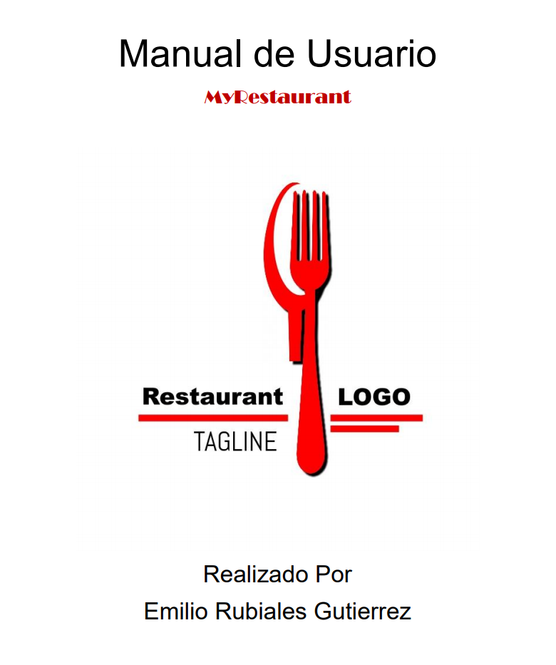
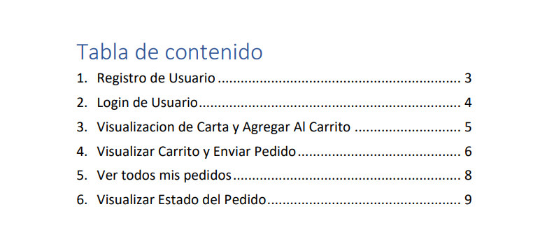
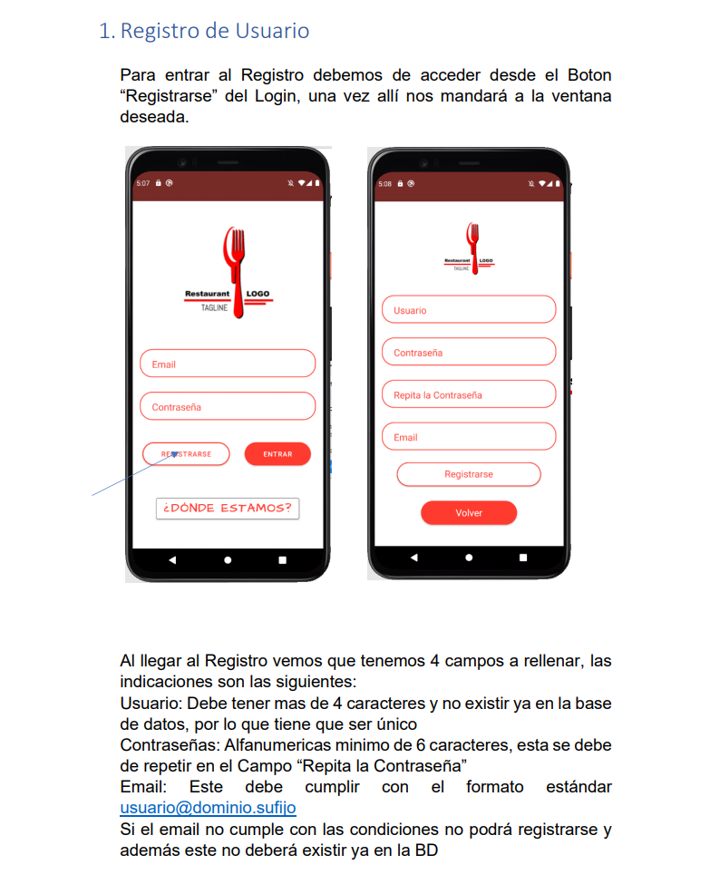
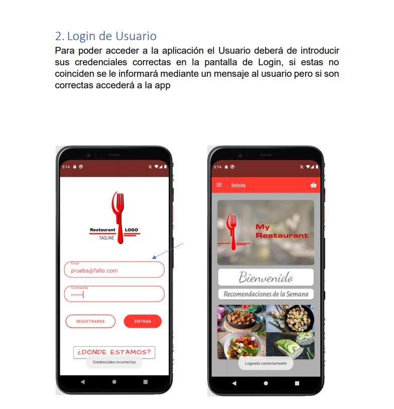
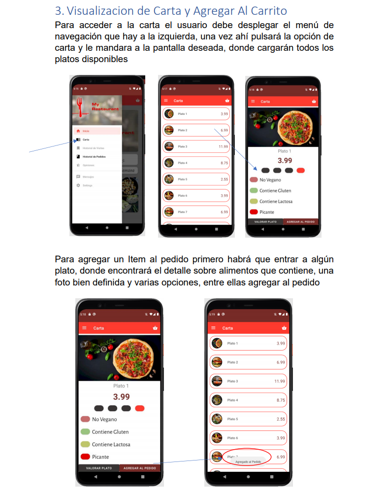
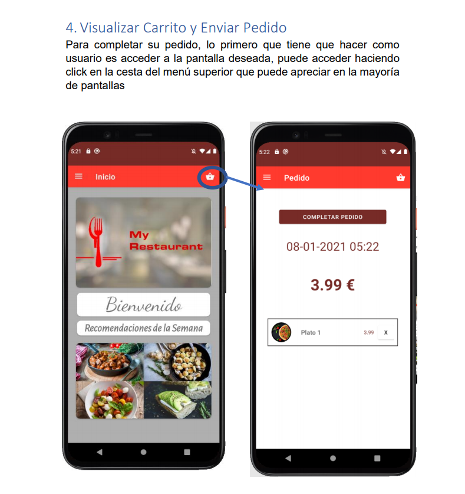
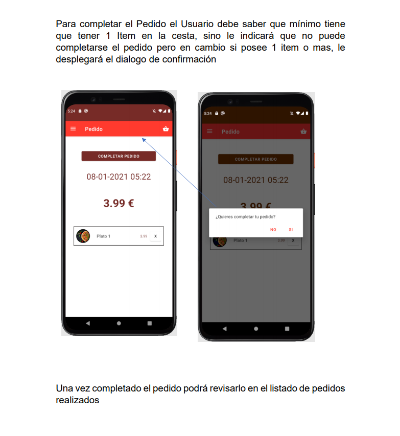
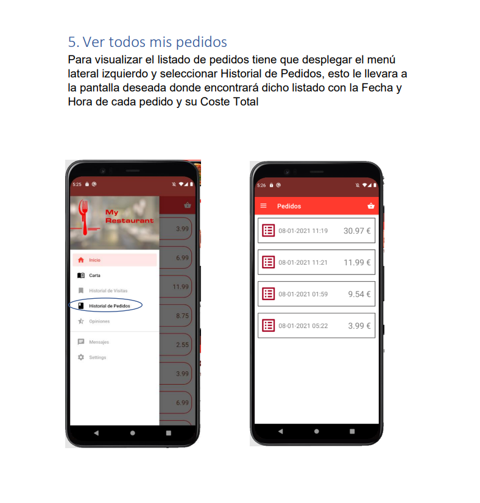
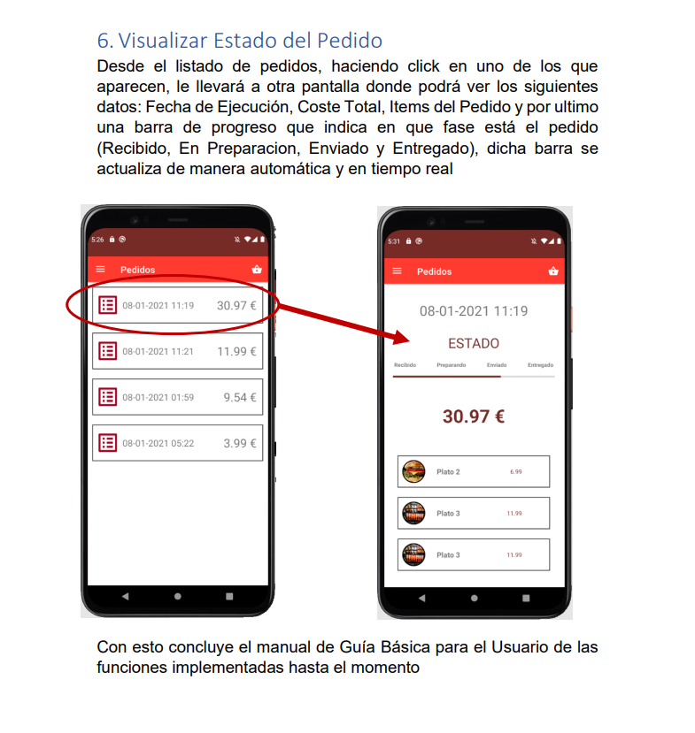

<html lang="es">
  <head>

    <meta charset="utf-8">
    <meta name="viewport" content="width=device-width, initial-scale=1, shrink-to-fit=no">
    <title>My Restaurant - Manual Usuario</title>

  </head>
 <body>
  <h1>Manual de Usuario</h1>
  
  
  
  
  
  
  
  
  
</body>
</html>
